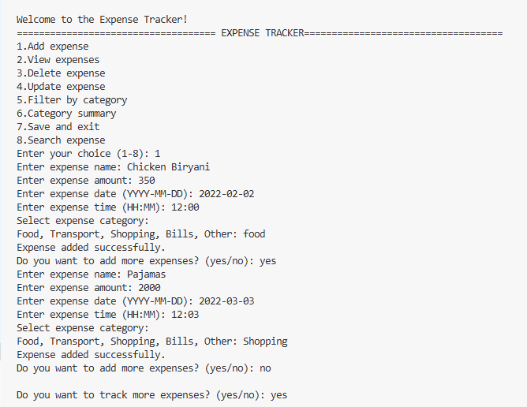
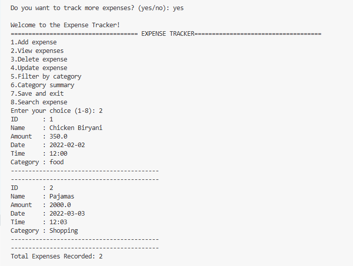
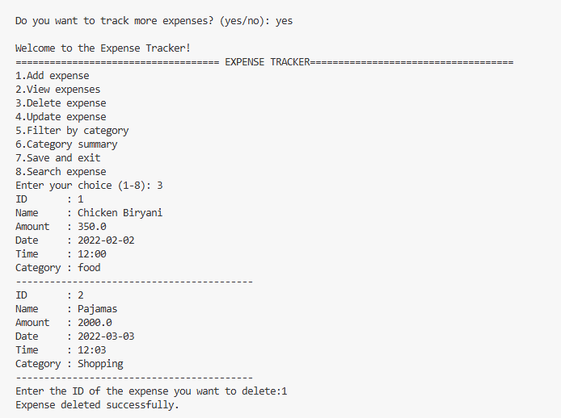
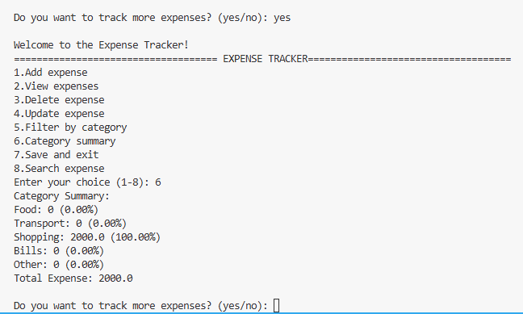
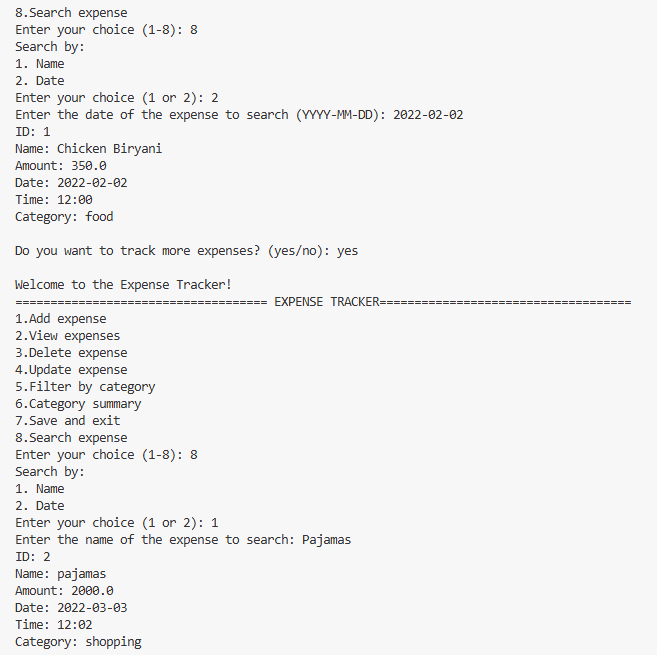

# Month 1 Projects — Python Internship

This repository contains projects completed during Month 1 of the Python programming internship, focused on core Python concepts through practical, real-world CLI applications.

---

## Project 1: Personal Expense Tracker

A command-line application to add, manage, and analyze personal expenses with data persistence.

### Features

**Core Functionality**
- Add new expenses with name, amount, date, time, and category
- View all recorded expenses
- Delete an expense by its unique ID
- Update an existing expense by ID
- Filter expenses by category
- Search for an expense by name
- Category-wise summary showing total amount and percentage breakdown per category
- Auto-save expenses to a file on exit
- Auto-load previously saved expenses on startup

**Validation & Error Handling**
- Expense name must contain only letters (rejects numbers/symbols)
- Expense amount must be a valid positive number (zero and negative values rejected)
- Date must follow `YYYY-MM-DD` format, validated using Python's `datetime` module
- Time must follow `HH:MM` format, validated using Python's `datetime` module
- Category restricted to a fixed list: Food, Transport, Shopping, Bills, Other
- Menu choice input validated (non-numeric input handled gracefully)
- File loading handles missing file (`FileNotFoundError`) and blank lines safely

**Data Integrity**
- Unique auto-incrementing ID system for every expense (IDs never reused or duplicated, even after deletions)
- Backward-compatible file loading (supports both old 3-field and new 5-field saved formats)

### How to Run
```bash
python expenses.py
```

### Requirements
- Python 3.x (uses only the built-in `datetime` module — no external dependencies)

### Menu Options
Add expense
View expenses
Delete expense
Update expense
Filter by category
Category summary
Save and exit
Search expense
### Outputs
## Sample Output

### Adding Expense


### Viewing Expense


### Delete Expense


### Category Summary


### Search Expense
